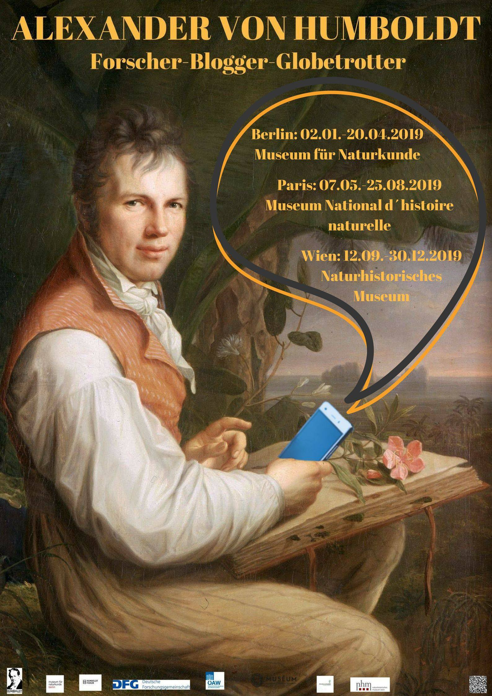

 
 
 

**Konzept**

Alexander von Humboldt, geboren am 14. September 1769 in Berlin, hat als erster Europäer das eurozentrische Denken infrage gestellt, hat die erste internationale Forschungsgemeinschaft begründet, war der erste Reiseblogger der Neuzeit mit tausenden „Followern“. Und doch: Wir kennen diesen letzten Aufklärer und Vordenker der Globalisierung nur mehr als „Stockpreußen“ und verschrobene Romanfigur.

Die Ausstellung „Alexander von Humboldt – Forscher, Blogger, Globetrotter“, die im Humboldtjahr 2019 in Berlin, Paris und Wien gezeigt werden soll, macht deutlich, dass Humboldt auf keinen Sockel gehört, sondern zu uns. Sie präsentiert Humboldt als Kind der Goethezeit und zugleich als Vordenker Darwins, Foucaults und Marshall McLuhans; als Entdecker nicht nur der Neuen Welt, sondern eines neuen, transnationalen Denkens und einer Demokratie des Wissens.

Um dieser "neuen" Deutung Humboldts gerecht zu werden, planen wir eine Wanderausstellung in den drei genannten Städten.  Dazu soll der Fokus nicht nur auf die Ursprünge und Ausbildung Humboldts gelegt werden, sondern im Besonderen auf seine Reisetätigkeit, die ihn und -viel wichtiger- sein Schaffen bis heute in Erinnerung gehalten hat. Als Objekte werden deshalb Gegenstände verwendet, die die Arbeitstätigkeit von Humboldts visualisieren, seine Arbeitsweise demonstrieren und die Ergebnisse seiner Arbeit zeigen. So wird beispielsweise das Arbeitszimmer in dem Humboldt in Paris gewirkt hat -teilweise mit Originalobjekten, wie seinem Schreibtisch- nachbildet. Außerdem natürlich die auf der Reise mitgeführten Instrumente, von denen Humboldt zahlreiche besaß und die für seine Tätigkeit essentiell gewesen sind. Weiterhin soll -soweit es möglich ist- auch die Rahmenbedingung in denen Humboldt gewirkt und gelebt hat einen Platz in der Ausstellung finden. 

Zielgruppe ist eben nicht nur die wissenschaftliche Fachwelt, sondern vor allem interessierte Laien aus allen Teilen der Bevölkerung, da Humboldt in seinem Wirken und Arbeiten nie elitäre Ziele verfolgte. Um Besuche von Schulklassen zu ermöglichen wird die Altersbegrenzung auf 15 Jahre festgelegt. 

Weitere Inhalte, die die Ausstellung begleiten, sind ein Filmabend, der am Tag vor der Eröffnung der Ausstellung stattfindet sowie eine Homepage mit einer eigens programmierten App. Die Filme sollen durch regionale Künstler im Rahmen eines Filmwettbewerbs entstehen. Die bereisten Regionen und sein Wirken sollen für die Gegenwart visualisiert werden, um zu verdeutlichen, dass Humboldt -damals wie heute- am Puls der Zeit agiert hat und noch heute von Bedeutung ist. Die besten Einreichungen werden anschließend durch eine Fachjury ausgewählt und am Filmabend der Welt präsentiert. 

Durch die Homepage, die Präsenz in den sozialen Medien (z.B. Twitteraccount) und die App soll einerseits für Ausstellung geworben und andererseits der Besucher auch anschließend mit dem Thema in Verbindung gehalten werden. Weiterhin dient die Homepage mit ihren Inhalten als Werbeplattform, um weitere finanzielle Zuwendungen zu erwirtschaften und das Projekt weiter zu finanzieren. Durch integrierte Features wie QR-Codes in Kombination mit Geocaching an Bedeutenden humboldtianischen Orten wird eine Beteiligung von Interessierten und Besuchern ermöglicht. 

Unterstützer und Geldgeber in diesem Vorhaben sollen neben der Humboldtstiftung, die Volkswagenstiftung, das Humboldtforum, das Auswärtige Amt der Bundesrepublik Deutschland, die Carl Zeiss AG sowie die jeweiligen Wissenschaftsakademien der 3 Länder, in welchen die Ausstellung gastiert. Im Falle Wiens ist dies die Österreichische Akademie der Wissenschaft sowie das Naturhistorische Museum Wiens, deren Räumlichkeiten und Infrastruktur wir für unsere Ausstellung nutzen wollen, da es hier aufgrund der Thematik Synergieeffekte gibt. 

Unser langfristiger Traum und Wunsch ist es die Ausstellung auch über das Jubiläumsjahr 2019 hinaus zu erhalten, um das moderne transnationale Wirken und Handeln Humboldts über den Kontext seiner Zeit hinaus auch in anderen Großstädten der Welt zu präsentieren, um so dieser Maxime gerecht zu werden. Außerdem streben wir eine Anbindung an Forschungsprojekte an, die mit dem Thema in Verbindung stehen. 

 
 

**Kostenaufstellung** 
 

**1. Kostenfaktoren** (am Beispiel der Ausstellung im NHM in Wien)

|Objektbezogene Kosten (Kunstspedition, Versicherung)|_____________________________|50.000 Euro (Leihgebühren werden üblicherweise in Deutschland nicht berechnet.)|
|--------------------|--------------------------------------------------|-------------------------------------|
|Ausstellungskosten (Personalkosten (Erarbeitung durch 5 Personen), Ausstellungsdesign, Auf-, Abbau, Bild-, Tonrechte, Vermittlungsprogramm)|_____________________________|        90.000 Euro|
|**Saalmiete** |_____________________________| **Entfällt**, da nicht kommerziell|
|**Bewerbung, Marketing**|_____________________________|**Entfällt**, da von NHM|
|**Eröffnung der Ausstellung, Presseempfang** etc.|_____________________________|**Entfällt**|
|**Katalog**|_____________________________|**25.000**|
|**Homepage und App**|_____________________________|**20.000**|
|_________________|___________________|__________________________|
|Gesamtkosten|_____________________________|ca. **185.000**|

 
 
 

**2. Leihgaben** 
   
  
 + Schreibtisch (Paris, ca. Ende 18. Jh.)
 + 1 Arbeitsstuhl (Deutsches Historisches Museum, Ende 18. Jh.)
 + Büste Humboldt (DHM oder HU-Berlin, 1815 bzw. 1823)
 + 4 Gemälde:
     - Arbeitszimmer von Humboldt (Kunstbibliothek-Staatl. Museen Berlin, ca. 1842)
     - Porträt (Schloss Charlottenhof, 1843)
     - Bildnis Humboldt bei der Arbeit (Alte Nationalgalerie-Staatl. Museen Berlin, 1806)
     - Portrait mit Chimborazo (Metropolian Museum of Art, 1859)
-	Faksimle der Unabhänigkeitserklärung USA (NA Washington, 1776)
-	20-30 Stücke aus der mexikanischen Sammlung - Werkzeuge, Präparate (Berlin)
-	4-5 Präparate aus der botanischen und biologischen Sammlung Humboldts (Berlin)
-	1 Instrumentenkoffer Humboldt (Kolumbien, ca. 1794, zurückgelassen)
-	ca. 10 Messinstrumente aus der Zeit Humboldts (NHM Wien)
-	Gesamtzahl ca. 50 Stück

 

 

**3. Keine Kosten verursachen** (Infrastruktur des NHM):

+ Vitrinen
+ Multimediastationen (Bespielung einkalkuliert in Kostenpunkt "Ausstellungsdesign")
+ Aufhängesysteme, Absperrsysteme 
+ Personalkosten der laufenden Ausstellungen

 
 

**4. Beispiel Ausstellungstafel:**

<object width= "800"
 heigt="3000"
 type="application/pdf"
 data="/files/Humboldt_18.pdf">
</object> 

**5. Finaler Plakatentwurf** (Anna-Lena):
 

